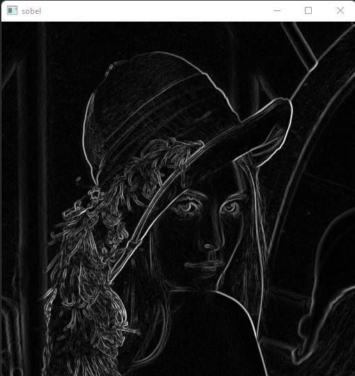

# Computer Vision Project 1
In this project we have implemented some Image Processing Techniques implemented from scratch using C++, we have implemented our Techniques in this readme in lenna image for more illustration. 

[Appendix](appendix/appendix.md)

##### Lenna Image

<br>
### Prerequsites
1. Visual Studio C++ Workload
2. OpenCV
3. CMake

<br>

### Build
1. Configure project.

*N.b* use only after cloning or changing *CMakeLists.txt*.
```sh
$ cmake . -B ./build
```
2. Build the executable
```sh
$ cmake --build ./build/
```
3. The executable will be in the *build/Debug/* folder
```sh
$ build/Debug/cv-project-1.exe
```
4. Clean the build folder (Optional)
```sh
$ cmake --build ./build/ --target clean
```


<br>
## 1. Adding Noise To Image

Three types of noise are implemented in this project: Uniform, Gaussian, and Salt & Pepper noise

`img::Image add_noise(img::Image image , std::string type ,uchar noise_factor) `

#### Parameters 

` image ` : the image on which the should be added, it should be of class img::Image which is implemented in this project.

` type ` : the type of noise you want to add, there are three types you must write any one of them "Gaussian", "Uniform" , and "Salt".

` noise_factor ` : It's the ratio of the noise in the image.

#### Examples

##### 1.1 Uniform Noise


##### 1.2 Gaussian Noise


##### 1.3 Salt & Pepper Noise


<br>
## 2. Image Filtering

Three types of noise are implemented in this project: Median, Mean, and Gaussian filters.

`img::Image noise_filter(img::Image source,int size, std::string type  ,double std=1) `

#### Parameters 

` image ` : the image on which the should be added, it should be of calse img::Image

` type ` : the type of noise filter you want to apply, there are three types you must write any one of them "Gaussian", "Mean" , and "Median".

` std ` : It's the standard deviation of the gaussian kernal, it has a default value equals 1, It should be used only when using Gaussian filter unless it will be useless.
#### Examples
The following examples for filttering the Salt & Pepper noise implemented in this project.

##### 2.1 Median Filter


##### 2.2 Mean Filter


##### 2.3 Gaussian Filter


# 3- Edge detection 
Three types of detection are implemented in this project: Sobel, Prewitt, and Roberts.
sobel : 

`Image sobel(const Image &img, bool dx = true, bool dy = true)`

`Image prewitt(const Image &img, bool dx = true, bool dy = true)`

`Image roberts(const Image &img, bool dx = true, bool dy = true)`

`cvector<double> canny(const Image &img, double threshold1, double threshold2)`

#### Parameters 
` Image ` : Image 

` dx ` : if you want to detect the horizontal edges

` dy ` : if you want to detect the vertical edges

#### Examples

##### 3.1 Sobel Detection


##### 3.2 Prewitt Detection


##### 3.3 Roberts Detection


##### 3.4 canny Detection


## 4- Histogram and Distribution Curve
`
void Plot_Histogram(Image img,string image_type)
`

`
void plot_Distribution_curve(Image img,string image_type)
`
### Parameters 

` image ` : the image you want to plot its histogram and distribution curve, it should be of class img::Image which is implemented in this project.

` image_type ` : the type of image you entered "grayscale" or "color"

### Results
#### 4.1 Histogram

#### 4.2 Distribution Curve


## 5. Equalization

equalization has multiple steps of pipelining such as histogram loop, accumulation loop and mapping loop. 
this function is returning Image type so it can be used in further steps.
the whole function is implemented in image.cpp 

### Parameters:
img: the image which will be equalized. (image type)

### Results:


## 6. Normalization

Normalization is only dependent on few parameters which are min new value, max new value and the image itself.
by the given equation -> `(newrange * (value - oldmin) / oldrange) + newmin `
we can get the new value for a pixel
We put the equation in utils.cpp file, while the whole normalization function were put in the mentioned image class.

### Parameters:
img: the image which will be normalized. (image type)
min: minimum  percentage as this function is dynamic (not restricted to specific number). (0 - 100)
max: max percentage as this function is dynamic (not restricted to specific number).  (0 - 100)

### Results:
normalized between 0 and 20 percentage


normalized between 80 and 100 percentage


## 7. local and global thresholding

### 7.1 global thresholding
`Image globalThreshold(Image &img, float threshold, float mx_value, t_types thresholdType) ` for global Thresholding

`img` : the image that you want to threshold

`threshold` : threshold value 

`mx_value` : the value is set in place of pixel

`thresholdType` : threshold type can be 
`THRESH_BIN` if the value is greater than threshold so the maximum is set to the pixel or `THRESH_BIN_INV` if the value is greater than threshold so 0 is set to the pixel

### 7.2 local thresholding
`Image localThreshold(Image &img, float mx_value, t_types thresholdType) ` for local Thresholding it uses an adaptive gaussian thresholding algorithm

`img` : the image that you want to threshold

`threshold` : threshold value 

`mx_value` : the value is set in place of pixel

`thresholdType` : threshold type can be

`THRESH_BIN` if the value is greater than 
threshold so the maximum is set to the pixel or `THRESH_BIN_INV` if the value is greater than threshold so 0 is set to the pixel

### Results:


## 8.1- Transformation from color image to gray scale image
`
img::convert(img::Image source, "bgr", "gray");
`
### Result


## 8.2-Plot R,G,B Histograms with its Cumulative Curves
`
void Plot_Histogram(Image img,string image_type)
`

`
void Plot_Cumulative(Image img,string image_type)
`
### Results
#### Red Histogram

#### Green Histogram

#### Blue Histogram


#### Red Cumulative Curve

#### Green Cumulative Curve

#### Blue Cumulative Curve


## 9. low pass and high pass filter 
`Image PassFilter(Image &img, float freq_threshold,p_types pass_type)` to filter the frequency domain

`img` : the image that you want to filter

`freq_threshold` : frequency threshold value

`pass_type` : pass type can be 

`LOW_PASS_FILTER` it removes all the values that is above the frequency threshold , `HIGH_PASS_FILTER` it removes all the values that is below the frequency threshold

### Results


## 10. hybrid images 
`Image hybridImages(Image &img1, Image &img2)` it takes two images and merge them in one image using the low frequency of one image and the high frequency of the other image

### Results


