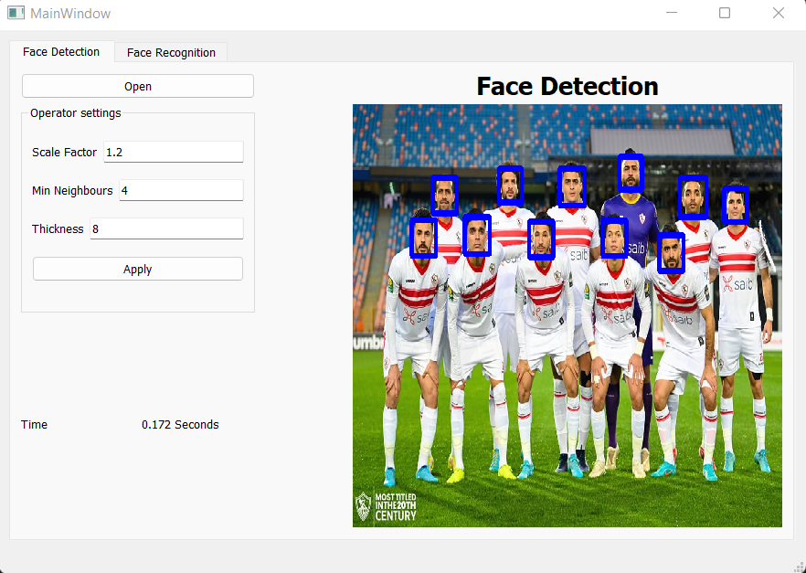
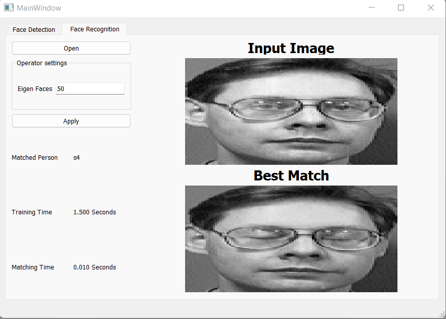
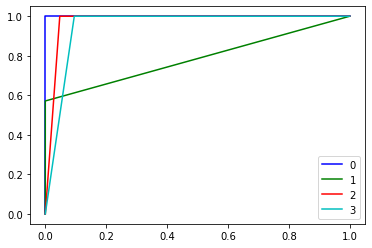

# PCA
The objective of this project is to highlight the importance of linear algebra in the field of computer vision and face recognition. Eigenface is the name of a set of eigenvectors computed from an image dataset. Eigenvectors is a set of features which characterize the global variation among face images.The basis of the eigenfaces method is the Principal Component Analysis (PCA). PCA is a dimensionality-reduction method that is often used to reduce the dimensionality of large data sets, by transforming a large set of variables into a smaller one that still contains most of the information in the large set. Roc & auc were made from scratch by making a cunfusion matrix for the tested cases, which are multi classes, then calculate sensitivity vs specificity.


## Setup
1. From the command line create a virtual environment and activate.
```sh
# Windows
> python -m venv .venv
> .venv\Scripts\activate

# Linux
> python3 -m venv .venv
> source .venv/bin/activate
```

2. Install the dependencies.
```sh
> pip install -r requirements.txt
```

1. To run the app
```sh
> python app.py
```
## Face Detection
```sh
detect_faces(img,scale_factor,minNeighbors,thickness)
```
#### Function:
* `img` : ndarray of the image.
* `Scale_factor` :  Parameter specifying how much the image size is reduced at each image scale.
* `minNeighbors` :Parameter specifying how many neighbors each candidate rectangle should have to retain it.
* `thickness` :Parameter specifying the thickness of rectangle which will be drawn around the detected face
### Result :


## Face Recognition
```sh
class Face_recognition(eigen_faces_num=50,threshold=2250)
```

#### Parameters
* `eigen_faces_num`: The number of selected eigen faces
* `threshold`: The distance threshold to determine if the image exist in the dataset
#### Methods
* `train(data_path)`: Fit the PCA model according to the given path of the training data.
* `recognize(img)`: Method to recognize the given image based on the training dataset
#### Result


## ROC 

* ROC & AUC were made from scratch by making a cunfusion matrix for the tested cases, which are multi classes, then calculate sensitivity vs specificity 
* ROC x axis is represnted by 1 - specificity, while the y axis is represnted by sensitivity.
* For making multi class ROC, we had to get each class related with the rest of classes.

### ROC Results

* For AUC, classes 0,1,2 and 3 has auc score equal 1.0, 0.7857142857142857, 0.9761904761904762 and 0.9523809523809523 respectively.

* For ROC curves, the resulted plot is as shown in the following plot:


---

## Team Work:

| Name | SEC | BN |
| ----------- | ----------- | ----------- |
| Ahmed Elbadawy | 1 | 4 |
| Zeyad Khaled | 1 | 35 |
| Abdelrahman Gamal | 1 | 46 |
| Abdallah Mohamed  | 1 | 49 |
| Amr Mohamed | 2 | 5 |

