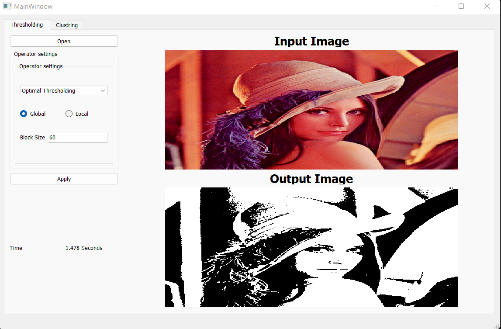
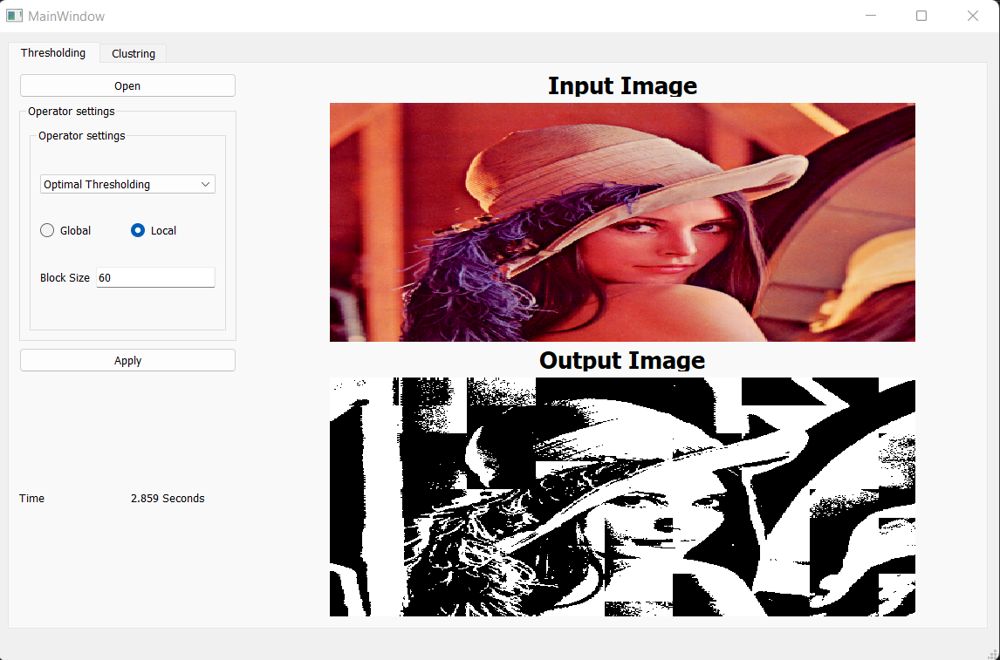
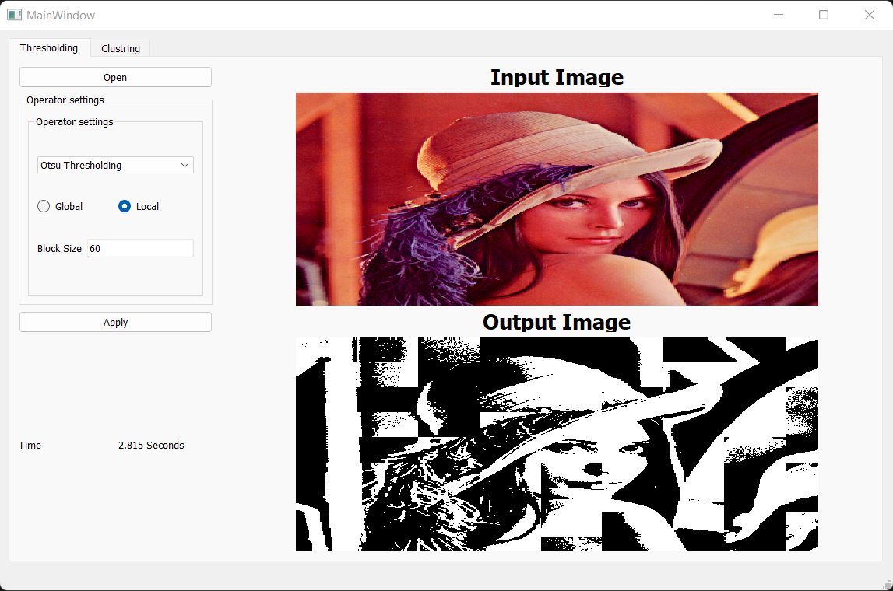
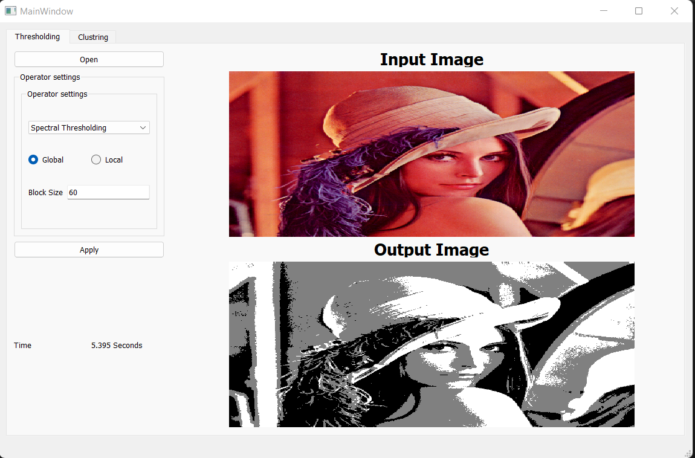
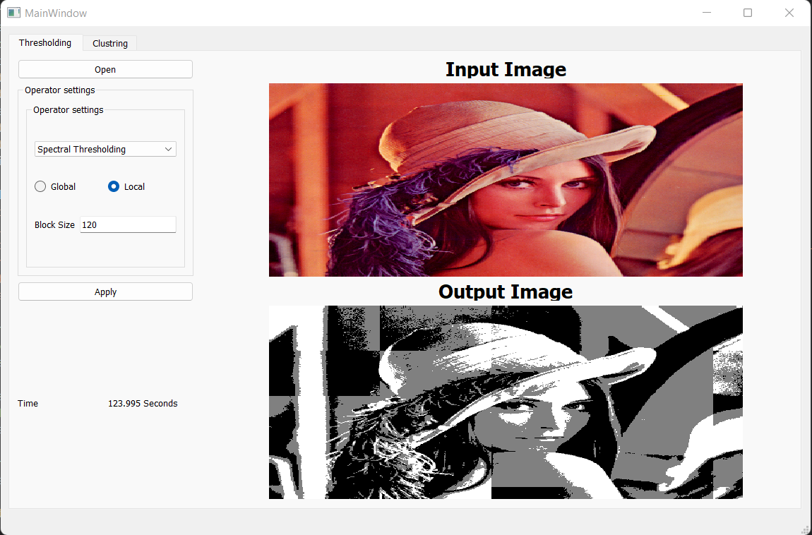
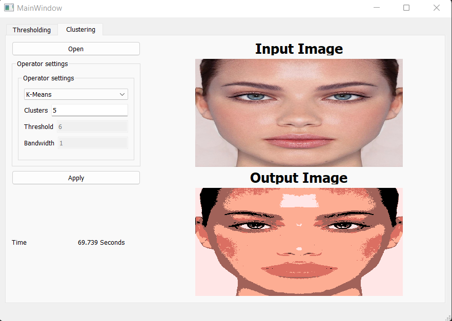
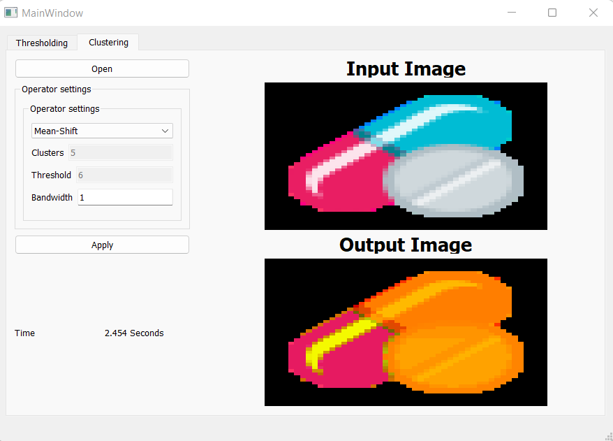
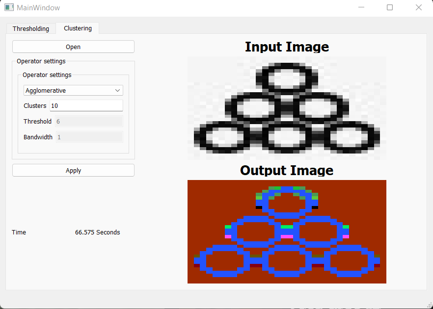
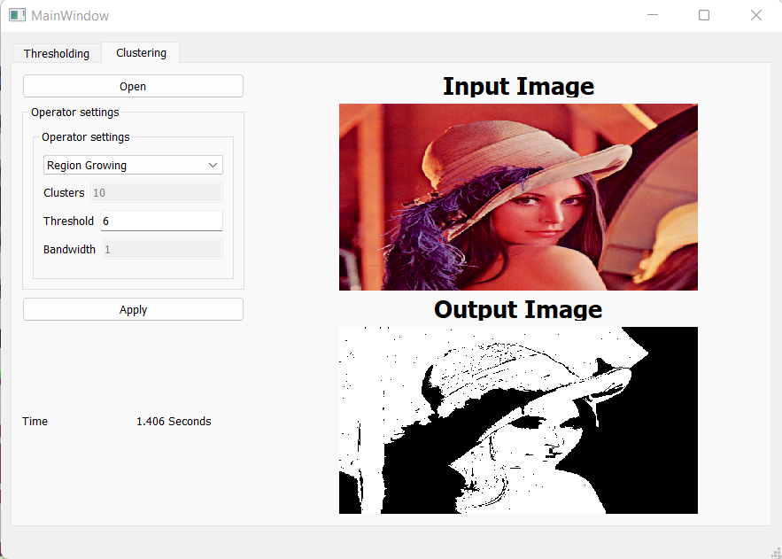

# Segmentation 
For given set of images (grayscale and color). We can apply various types of thresholding and do unsupervised segmentation.

## Setup
1. From the command line create a virtual environment and activate.
```sh
# Windows
> python -m venv .venv
> .venv\Scripts\activate

# Linux
> python3 -m venv .venv
> source .venv/bin/activate
```

2. Install the dependencies.
```sh
> pip install -r requirements.txt
```

3. To run the app.
```sh
> python app.py
```

## 1. Thresholding 
we implemented global and local thresholding for 3 types of thresholding Optimal, Otsu, and spectral thresholding.
### Global Thresholding
```
global_threshold(img, threshold_func)
```

#### function parameters:

* img: ndarray of the image.
* threshold_func: You can select 3 types of thresholding "optimal", "otsu", or "spectral".
#### Results:

### Local Thresholding
```
local_threshold(img, kernal_size, threshold_func)
```

##### function parameters:

* img: ndarray of the image.
* kernal_size: it's the block size used for the local thresholding.
* threshold_func: You can select 3 types of thresholding "optimal", "otsu", or "spectral".

### Results

#### 1. Optimal Thresholding

##### I. Global thresholding


##### II. local thresholding


#### 2. Otsu Thresholding

##### I. Global thresholding


##### II. local thresholding


#### 3. Spectral Thresholding

##### I. Global thresholding


##### II. local thresholding


## 1. Segmentation
### 1. K-Means Segmentation

### 2. Mean Shift Segmentation

### 3. Agglomerative Segmentation

### 4. Region Growing Segmentation

